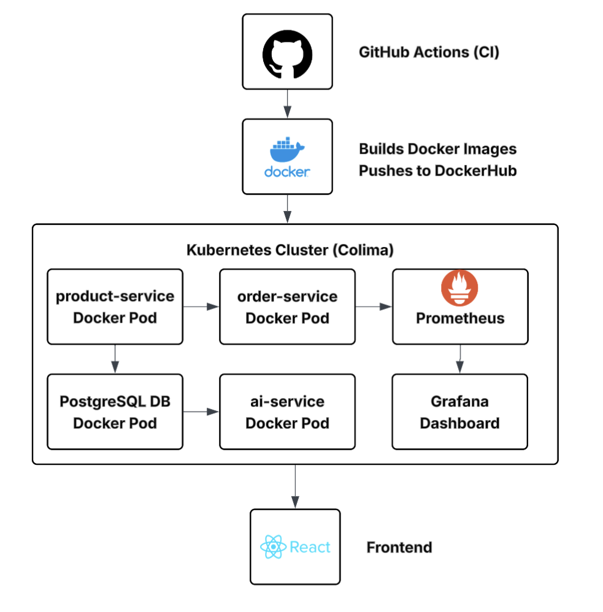

# AI-Enhanced E-Commerce Platform

A full-stack AI-powered e-commerce platform built with FastAPI microservices, PostgreSQL storage, GPT-powered features, and a modern React frontend. Designed and deployed locally using Kubernetes via Colima.

---

## Tech Stack

- **Frontend**: Vite + React + Tailwind CSS
- **Backend**: FastAPI (Python)
- **Database**: PostgreSQL (StatefulSet in Kubernetes)
- **AI Integration**: OpenAI GPT-3.5 (via API)
- **Infrastructure**: Docker + Kubernetes (k3s via Colima on M1 Mac)
- **Monitoring**: Prometheus + Grafana
- **CI**: GitHub Actions + Docker Buildx

---

## Microservices

### product-service
- FastAPI CRUD for products
- Inventory tracking with quantity
- PostgreSQL-backed via StatefulSet

### order-service
- FastAPI for order placement
- Validates stock with product-service
- Updates inventory via PATCH

### ai-service
- `/ai/summarize-products`: AI-generated product descriptions
- `/ai/recommend-products`: Recommends products based on user interests
- Uses OpenAI GPT via API key

---

## Frontend Features

- View all products (grouped, with quantity)
- View order history
- Checkout flow
- AI Summary page
- AI Product Recommender (interest-based GPT suggestions)

---
## 📸 Project Showcase

### 🔧 System Architecture
